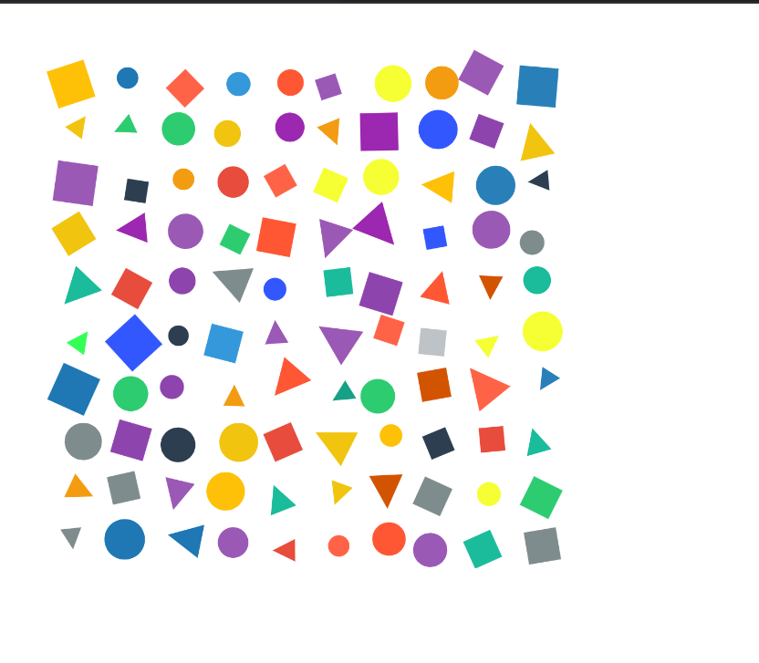

# Gridded Pattern with Controlled Randomness

This project builds upon previous weeks' work in creating grid-based patterns. It changed from a regular, symmetric grid of shapes into a dynamic, non-regular design through the introduction of controlled randomness. The pattern starts with a structured grid and introduces variations in shape, size, position, color, and rotation.

## Overview

In this project, we start with a regular grid layout, similar to the designs created in previous weeks, and gradually add randomness to make the grid visually unpredictable. Specifically, the project:

- **Starts with a Regular Grid**: A 10x10 grid of evenly spaced cells forms the base structure.
- **Introduces Random Variations**: Randomness is introduced step-by-step, modifying various properties of the shapes in each grid cell:
  - **Shape Type**: Shapes are randomly selected from a set of three types: circle, square, and triangle.
  - **Size**: Shapes are resized randomly within a specified range.
  - **Position**: Shapes are randomly offset within their grid cell.
  - **Rotation**: Each shape is rotated by a random angle.
  - **Color**: Colors are randomly chosen from a predefined color palette.

This design approach builds on earlier exercise of HW03 that involved creating regular, grid-based patterns with loops (from **HW03A**), but with an emphasis on adding more organic, non-regular variations through randomness.

## Features

- **Grid Layout**: A 10x10 grid of cells is created, with each cell containing a randomly selected shape.
- **Shape Randomization**: Shapes are randomly chosen from circles, squares, and triangles.
- **Size Variation**: Shapes are resized randomly within a defined range to break the grid's symmetry.
- **Position Offset**: Shapes are randomly offset within their grid cells, further distorting the regularity.
- **Rotation**: Shapes are randomly rotated, adding an additional layer of variation.
- **Color Palette**: Shapes are filled with randomly chosen colors from a predefined palette.

## Output
Output Image on repo:  

